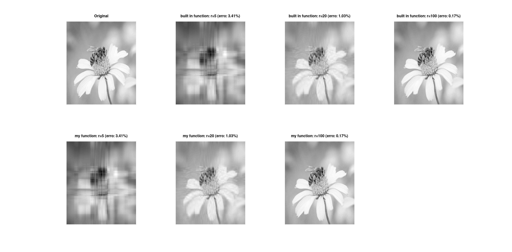
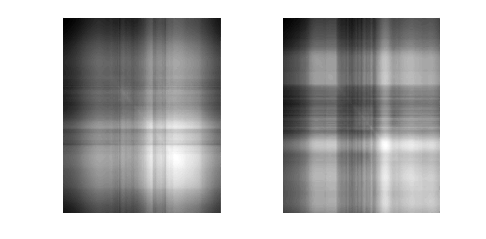
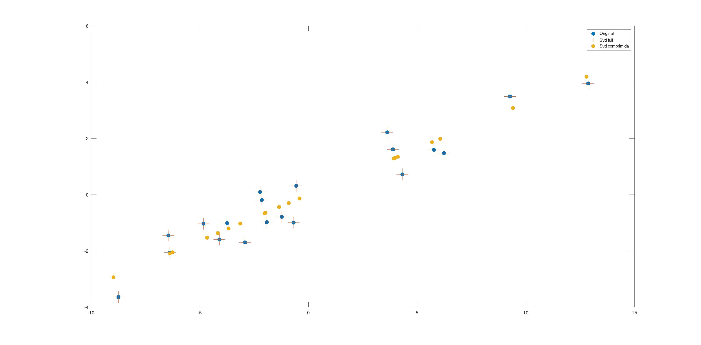
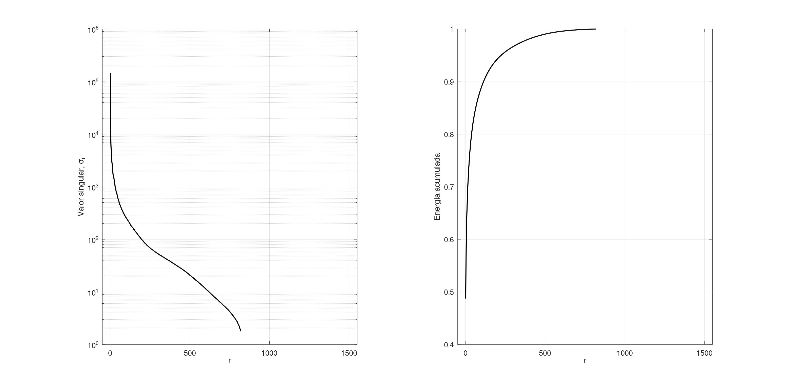

Vou simplificar o README e adicionar suas imagens:
markdown# SVD Image Compression

Implementation of Singular Value Decomposition (SVD) from scratch in Octave/MATLAB for image compression.

## What is SVD?

SVD decomposes a matrix A into three matrices:

**A = U × Σ × V^T**

For image compression, we keep only the k largest singular values, creating a low-rank approximation that uses less memory while preserving image quality.

## Features

- **Custom SVD implementations:**
  - `svd_basica.m`: Full SVD
  - `svd_economica.m`: Economy-size SVD (more efficient)
  
- **Image compression:** Compare original vs compressed images at different ranks

- **Visualization:** Singular value spectrum and cumulative energy plots

## Results

### Image Compression Comparison
Custom implementation vs built-in function at different compression levels (r=5, 20, 100):



### Covariance Matrices
Visualization of X×X^T and X^T×X:



### 2D Data Approximation
SVD applied to random 2D data showing full reconstruction vs rank-1 compression:



### Singular Values Analysis
Decay of singular values (log scale) and cumulative energy:



## How to Run

1. Clone the repository
2. Add an image named `sqrAy.jpg` to the directory
3. Run in Octave/MATLAB:
```matlab
>> imagem           % Main compression demo
>> aprox_aleatorio  % 2D approximation example
>> svd_testes       % Basic SVD test
```

## Files

- `imagem.m` - Main image compression script
- `svd_economica.m` - Economy SVD implementation
- `svd_basica.m` - Full SVD implementation
- `aprox_aleatorio.m` - 2D data approximation demo
- `svd_testes.m` - Validation tests
